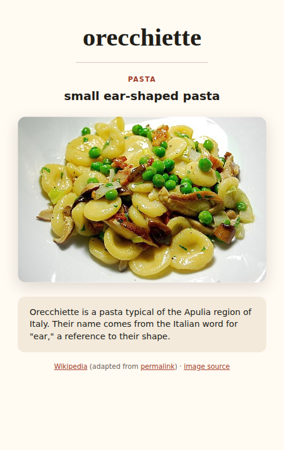
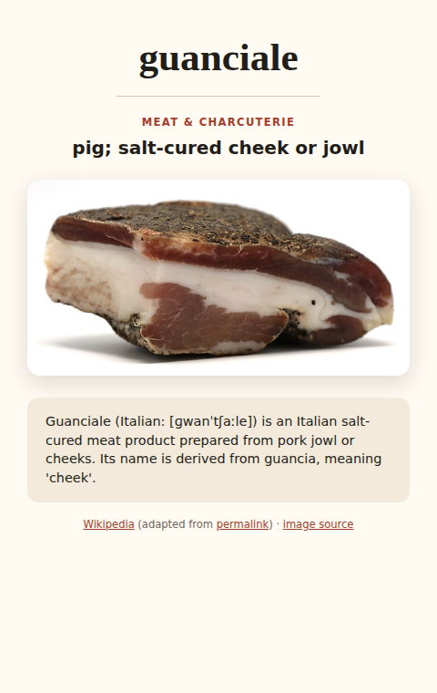
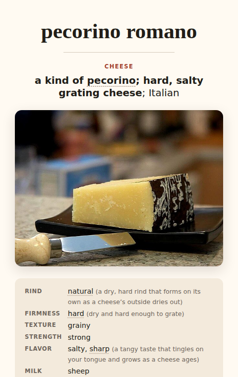
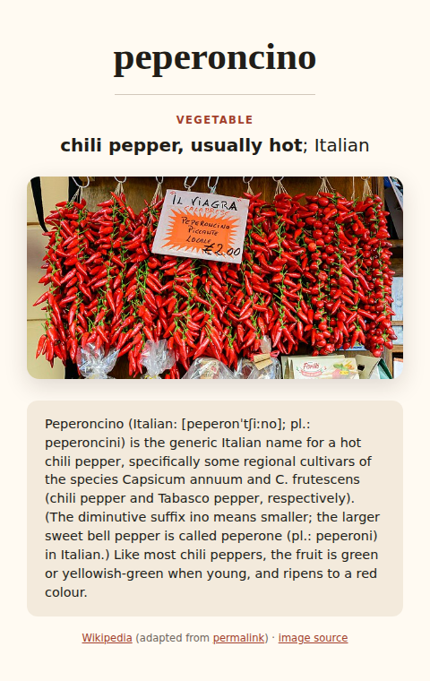

# Menu Foods Anki deck

An Anki deck for recognizing unfamiliar food words on restaurant menus. It
focuses on identification, not language production: seeing the bare term should
be enough to recall what kind of food it is and the characteristics that matter
most when ordering.

**[Download the latest Menu Foods deck](https://github.com/domenic/menu-foods-deck/releases/latest/download/menu-foods.apkg)**

The cards live in one mixed `Menu Foods` deck and cover pasta, meats and
charcuterie, cheeses, and other easily misclassified terms.

Category tags allow filtering if you'd prefer to just study pastas or similar.
But at least for me, "is this mystery foreign word a pasta or a meat?" is
important, so I suggest studying them all jumbled together.

## Example cards

<p align="center">
  
  
</p>
<p align="center">
  
  
</p>

## The data

[menu-foods.yaml](menu-foods.yaml) is the hand-edited card database. Here is a
sample entry:

```yaml
- term: feta
  category: cheese
  answer:
    core:
      - salty, crumbly, brined cheese
    context:
      - usually sheep’s milk
      - Greek
  details: >-
    Feta (FET-ə; Greek: φέτα [ˈfeta]) is a Greek brined white cheese made from
    sheep's milk or from a mixture of sheep and goat's milk. It is soft, with
    small or no holes, and no skin.
  source:
    label: Wikipedia
    url: https://en.wikipedia.org/wiki/Feta
    adapted_from: https://en.wikipedia.org/w/index.php?oldid=1367638105
  image: Feta_Cheese.jpg
```

`answer.core` renders in bold as the fast recognition cue. Optional
`answer.context` follows in normal weight as useful context. Typically, you
should grade yourself on only remembering the useful core, treating the extra
context and details as bonus information.

The explanatory `details` are checked-in snapshots; many are short extracts
retrieved from English Wikipedia. Builds never fetch article text, so upstream
edits do not silently change the deck; updates must be made deliberately in the
YAML. (See [below](#development) for how to refresh them semi-automatically.)

## Card design

The front contains only the menu term. The back contains:

- a compact headline with crucial facts bolded first;
- a representative image;
- short explanatory context; and
- links to the text and image sources.

The note model includes compact desktop styling and readable mobile/night-mode
colors. Fixed deck/model IDs and deterministic note GUIDs ensure that successive
packages identify the same generated deck objects.

The build script creates a deck. Import `dist/menu-foods.apkg` through Anki's
normal import interface.

## Development

### Build the deck

Install [uv](https://docs.astral.sh/uv/), then run:

```sh
uv run python build_deck.py
```

The first build downloads the 212 explicitly selected Commons images and caches
them under `.cache/media/`, then writes `dist/menu-foods.apkg`.

Later builds can prohibit network access and require a complete local cache:

```sh
uv run python build_deck.py --offline
```

The builder uses `SOURCE_DATE_EPOCH` when provided, plus sorted media and
normalized ZIP metadata, so identical source, media, and timestamps produce an
identical `.apkg` file. CI uses the source commit's timestamp, allowing later
releases to update earlier imports while keeping each release reproducible.

### Validate and test

Validate the YAML without downloading media or writing a package:

```sh
uv run python build_deck.py --check
```

Run the tests:

```sh
uv run python -m unittest discover -s test -v
```

### Regenerate screenshots

After installing the [Playwright](https://playwright.dev/) CLI and its Chromium
browser, regenerate the README card screenshots with:

```sh
playwright install chromium
uv run python generate_screenshots.py
```

### Refresh Wikipedia descriptions

Check tracked Wikipedia descriptions against the current article leads:

```sh
uv run wikipedia_descriptions.py check
```

The command reports text differences without writing anything. To refresh every
tracked description and source revision, run:

```sh
uv run wikipedia_descriptions.py update
```

Only changed cards are rewritten; review the resulting `menu-foods.yaml` diff in
Git before committing it. Descriptions without a permanent Wikipedia revision in
`source.adapted_from` are skipped by both commands.

### Publish a release

Release tags must be `v` followed by the version in `pyproject.toml`; CI rejects
mismatches. Use `uv` to update both the project metadata and lockfile, then
commit and tag the result. For example, to promote `1.0.0.dev0` to `1.0.0`:

```sh
uv version --bump stable
version=$(uv version --short)
git add pyproject.toml uv.lock
git commit -m "v$version"
git tag -a "v$version" -m "v$version"
git push --atomic origin main "v$version"
```

For later releases, `uv version --bump major`, `minor`, or `patch` provides the
corresponding version increments.

## Third-party material

The repository's MIT license covers the original code and original portions of
the deck data. Explanatory text and images retain their respective source terms;
every card includes source links. See
[THIRD_PARTY_NOTICES.md](THIRD_PARTY_NOTICES.md) for details.
